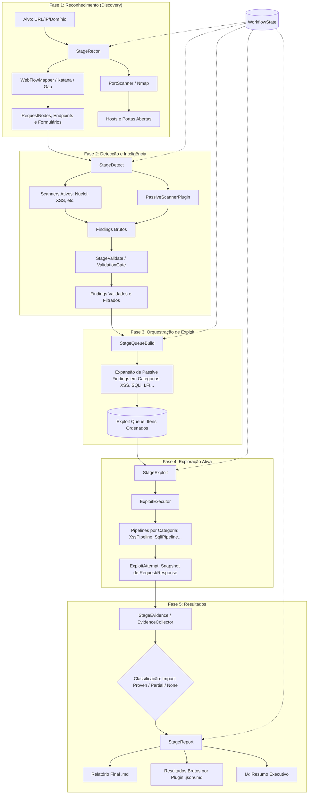

# Arquitetura e Fluxo de Execução — ReconForge

Este documento descreve o funcionamento interno do ReconForge, detalhando como os dados fluem desde o alvo inicial até o relatório final.

## Diagrama de Fluxo (Mermaid)

## Descrição dos Estágios

### 1. StageRecon (Descoberta)
Mapeia a superfície de ataque. Utiliza browsers reais (Playwright) e coletores históricos (Gau/Katana) para identificar todos os endpoints, formulários e requisições de rede.

### 2. StageDetect (Inteligência)
Os scanners ativos procuram por assinaturas conhecidas. O **PassiveScannerPlugin** converte cada endpoint com parâmetros em um "achado em potencial" para garantir cobertura total.

### 3. StageValidate (Triagem)
O **ValidationGate** filtra ruídos, remove duplicatas e garante que apenas alvos com pontuação de confiança suficiente avancem para a fila de ataque.

### 4. StageQueueBuild (Orquestração)
Transforma os achados em tarefas concretas na `ExploitQueue`. Se um endpoint é marcado como "passivo", ele é expandido em múltiplas categorias de teste (XSS, SQLi, LFI, SSRF, IDOR).

### 5. StageExploit (Ataque Ativo)
Executa os payloads de exploração reais. Cada tentativa gera um snapshot completo (Request/Response) para auditoria.

### 6. StageReport (Documentação)
Compila as evidências. Gera o relatório principal em Markdown e exporta os resultados brutos de cada plugin para a pasta `plugins_raw/`, incluindo os comandos exatos executados.
