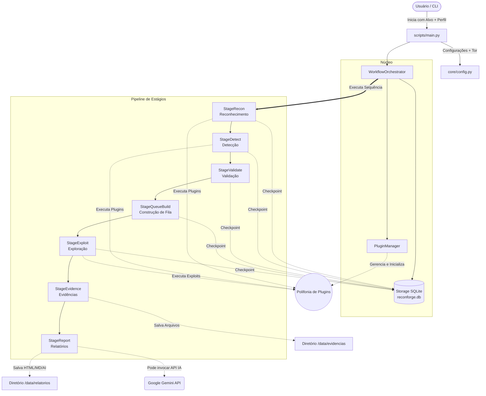

# Arquitetura do ReconForge

O **ReconForge** é uma ferramenta CLI focada em segurança ofensiva e reconhecimento, que opera através de um pipeline estruturado em estágios. O núcleo do sistema gerencia o fluxo de informações, garantindo que os dados descobertos em uma etapa sejam utilizados nas etapas seguintes, e mantém um registro de persistência em um banco de dados SQLite para permitir retomadas e análises detalhadas.

## Diagrama de Fluxo

Abaixo encontra-se o diagrama representando como os diferentes componentes da aplicação interagem durante a execução.

---

## Descrição dos Componentes Principais

### 1. `scripts/main.py` (CLI & Entrypoint)
O ponto de entrada da aplicação. Ele lida com os argumentos passados pelo usuário (ex: alvo, uso de arquivos de sessão, ativação ou não de Tor, escolha de perfis como `web-map` ou execução avulsa de plugins). Valida o ambiente (healthcheck) e inicia o orchestrator.

### 2. `core/workflow_orchestrator.py`
O cérebro do sistema. Ele instancia o **PluginManager** e o **Storage** e executa o *Pipeline*. Ele mantém o `WorkflowState`, que acumula informações, e após cada estágio o estado passa por um checkpoint (salvo no SQLite). Caso algum *gate* de decisão falhe, o orchestrator sabe como pular para estágios seguros (ex: ir direto para o relatório final).

### 3. `core/plugin_manager.py` (Gerenciador de Plugins)
Módulo responsável por escanear a pasta `plugins/`, ignorar classes base dinamicamente, checar e validar dependências do sistema e do python (ex: se o comando `nmap` está instalado) e checar definições de configuração (quais plugins estão habilitados ou desabilitados vs se usam a rede TOR).

### 4. Estágios do Pipeline (`StageBase`)

O diferencial do ReconForge está na separação limpa das fases de um *PenTest / Reconhecimento*:

- **`StageRecon`**: Executa os plugins voltados a reconhecimento básico e passivo da infraestrutura/domínio (DNSResolver, PortScanner, Subfinder, Nmap, etc).
- **`StageDetect`**: Toma o output do estágio anterior e realiza testes em busca de vulnerabilidades e caminhos possíveis sem exploração aprofundada. (Ex: WebFlowMapperPlugin, KatanaCrawlerPlugin, Nuclei, etc).
- **`StageValidate`**: Filtra as descobertas. Descarta falsos-positivos reportados. Pode deduzir severidades reais.
- **`StageQueueBuild`**: Pega as fraquezas confirmadas da validação e monta uma fila (queue) pronta para as tentativas de intrusão mais profundas.
- **`StageExploit`**: Utiliza tentativas seguras baseadas na configuração (`max_exploit_attempts`) contra os pontos elencados e classificados na fila.
- **`StageEvidence`**: Coleta os retornos dos exploits bem consolidados (prints, logs de tela, status codes) para comprovar a falha e salvar na pasta.
- **`StageReport`**: Pega todo o run_id, as estatísticas parciais guardadas, aciona a IA Gemini (caso configurada) para analisar e redigir sumários descritivos da falha, gerando assim relatórios em texto legível.
